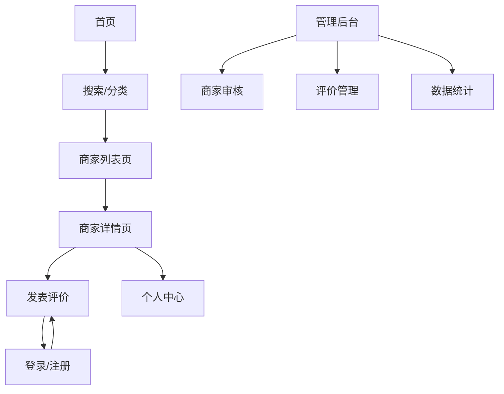

## 1. Product Overview
简化版大众点评网站应用，为用户提供本地商家信息浏览、评价和搜索服务。用户可以发现周边商家、查看详细信息、发表评价，管理员可以审核商家信息和用户评价。

目标用户：需要查找本地商家信息和参考他人评价的消费者，以及希望展示自己服务的本地商家。

## 2. Core Features

### 2.1 User Roles
| Role | Registration Method | Core Permissions |
|------|---------------------|------------------|
| Consumer | 手机号+验证码或邮箱+密码注册 | 浏览商家、发表评价、管理个人资料 |
| Admin | 后台创建 | 审核商家信息、管理用户评价、查看统计数据 |
| Business Owner | 申请认证 | 管理商家信息、回复用户评价 |

### 2.2 Feature Module
核心功能页面包括：
1. **首页**：商家推荐、分类导航、搜索入口
2. **商家列表页**：分类筛选、搜索结果、排序功能
3. **商家详情页**：商家信息、评价列表、评分统计
4. **评价页面**：发表评价、上传图片、星级评分
5. **个人中心**：个人资料、我的评价、收藏商家
6. **管理后台**：商家审核、评价管理、数据统计

### 2.3 Page Details
| Page Name | Module Name | Feature description |
|-----------|-------------|---------------------|
| 首页 | 搜索栏 | 输入关键词搜索商家，支持按名称、分类、位置筛选 |
| 首页 | 分类导航 | 展示餐饮、娱乐、购物等基础分类，点击跳转到对应列表 |
| 首页 | 推荐商家 | 展示热门或高评分商家，支持轮播展示 |
| 商家列表页 | 筛选器 | 按分类、位置、评分等条件筛选商家 |
| 商家列表页 | 商家卡片 | 展示商家缩略图、名称、评分、地址等基础信息 |
| 商家列表页 | 排序功能 | 按评分、距离、人气等维度排序 |
| 商家详情页 | 商家信息 | 展示名称、地址、联系方式、营业时间、商家图片 |
| 商家详情页 | 评分统计 | 显示总体评分、各星级分布、评价数量 |
| 商家详情页 | 评价列表 | 按时间倒序展示用户评价，支持分页加载 |
| 评价页面 | 星级评分 | 1-5星评分选择器，支持半星评分 |
| 评价页面 | 文字评价 | 多行文本输入框，支持emoji表情 |
| 评价页面 | 图片上传 | 支持多张图片上传，显示上传进度 |
| 个人中心 | 个人资料 | 头像、昵称、联系方式编辑，支持头像上传 |
| 个人中心 | 我的评价 | 展示用户发表的所有评价，支持编辑和删除 |
| 个人中心 | 收藏商家 | 展示用户收藏的商家列表，支持取消收藏 |
| 登录注册页 | 手机号登录 | 输入手机号和验证码登录 |
| 登录注册页 | 邮箱登录 | 输入邮箱和密码登录 |
| 登录注册页 | 用户注册 | 支持手机号和邮箱两种注册方式 |
| 管理后台 | 商家审核 | 审核新提交的商家信息，支持通过/拒绝 |
| 管理后台 | 评价管理 | 查看和管理所有用户评价，支持删除违规评价 |
| 管理后台 | 数据统计 | 展示用户增长、商家数量、评价数量等基础数据 |

## 3. Core Process

### 用户流程：
1. 用户访问首页，可以通过搜索或分类导航查找商家
2. 进入商家列表页，使用筛选和排序功能找到目标商家
3. 点击商家卡片进入详情页，查看商家信息和用户评价
4. 登录后可以发表评价，包括星级评分、文字评价和图片上传
5. 在个人中心管理个人资料、查看历史评价和收藏商家

### 管理员流程：
1. 登录管理后台，查看待审核的商家信息
2. 审核商家资料，决定是否通过认证
3. 监控用户评价内容，处理违规评价
4. 查看平台数据统计，了解运营情况

## 4. User Interface Design

### 4.1 Design Style
- **主色调**：橙色(#FF6B35)作为主品牌色，灰色(#666666)作为辅助色
- **按钮样式**：圆角矩形设计，主要按钮使用渐变色，次要按钮使用边框样式
- **字体选择**：中文使用PingFang SC，英文使用SF Pro Display，基础字号14-16px
- **布局风格**：卡片式布局，阴影效果，响应式网格系统
- **图标风格**：使用圆润的线性图标，保持视觉一致性

### 4.2 Page Design Overview
| Page Name | Module Name | UI Elements |
|-----------|-------------|-------------|
| 首页 | 搜索栏 | 顶部固定搜索框，圆角设计，占位文字引导搜索，搜索图标右侧显示 |
| 首页 | 分类导航 | 宫格布局展示分类图标，每个分类使用彩色背景+白色图标，3-4列自适应 |
| 首页 | 推荐商家 | 横向卡片滚动，展示商家封面图、名称、评分，支持手势滑动 |
| 商家列表页 | 商家卡片 | 左侧图片+右侧信息布局，包含名称、评分星级、地址、距离，卡片悬停效果 |
| 商家详情页 | 商家信息 | 顶部轮播图展示商家图片，下方信息区域使用卡片分组展示详细信息 |
| 商家详情页 | 评分统计 | 环形进度条展示总体评分，下方条形图展示各星级分布 |
| 评价页面 | 星级评分 | 大尺寸星星图标，支持点击和悬停交互，实时显示评分文字描述 |
| 评价页面 | 图片上传 | 网格布局展示已选图片，支持拖拽排序，上传进度条显示 |
| 个人中心 | 个人资料 | 顶部头像区域，圆形头像+昵称，下方列表形式展示个人信息选项 |
| 管理后台 | 数据卡片 | 彩色背景的数据统计卡片，展示关键指标数字和趋势图标 |

### 4.3 Responsiveness
采用桌面端优先的响应式设计：
- **桌面端**（1200px+）：三栏布局，充分利用屏幕空间展示更多信息
- **平板端**（768px-1199px）：双栏布局，保持功能完整性的同时优化触控体验
- **移动端**（<768px）：单栏布局，底部导航栏，优化触摸交互和单手操作
- **图片响应式**：使用srcset和picture元素，根据设备加载合适尺寸的图片
- **触控优化**：移动端增加按钮点击区域，支持手势操作如滑动、下拉刷新