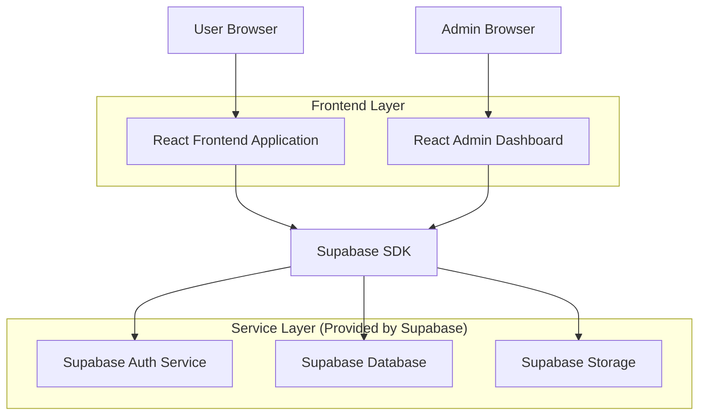
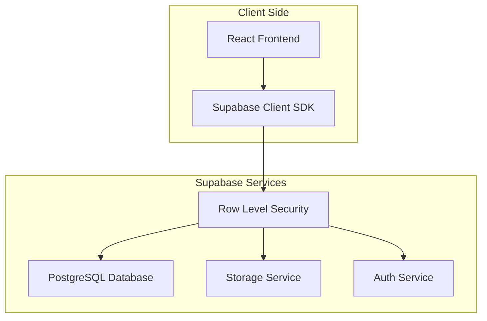
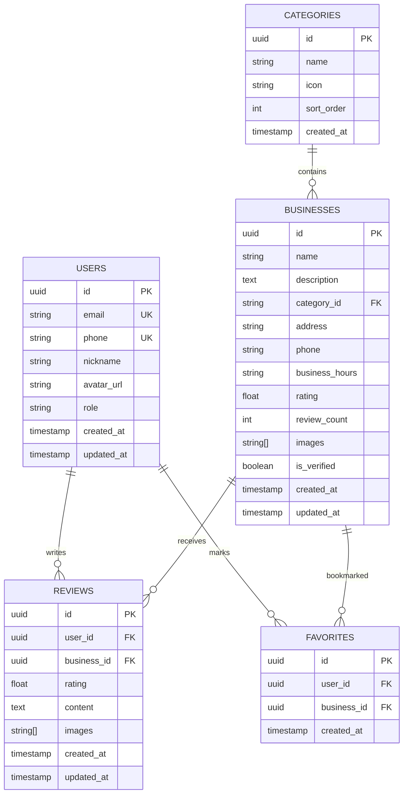

## 1. Architecture design



## 2. Technology Description

- Frontend: React@18 + tailwindcss@3 + vite
- Backend: Supabase (BaaS)
- Database: PostgreSQL (via Supabase)
- Authentication: Supabase Auth
- File Storage: Supabase Storage
- UI Framework: Ant Design@5

## 3. Route definitions

| Route | Purpose |
|-------|---------|
| / | 首页，展示推荐商家和分类导航 |
| /search | 搜索页面，显示搜索结果 |
| /category/:id | 分类页面，显示特定分类的商家列表 |
| /business/:id | 商家详情页，展示商家信息和评价 |
| /review/:businessId | 评价页面，发表对商家的评价 |
| /login | 登录页面，支持手机号和邮箱登录 |
| /register | 注册页面，用户注册新账户 |
| /profile | 个人中心，管理个人资料和评价 |
| /admin | 管理后台首页 |
| /admin/businesses | 商家管理页面 |
| /admin/reviews | 评价管理页面 |
| /admin/dashboard | 数据统计页面 |

## 4. API definitions

### 4.1 Authentication APIs

**用户注册**
```
POST /auth/v1/signup
```

Request:
```json
{
  "email": "user@example.com",
  "password": "123456",
  "phone": "13800138000",
  "data": {
    "nickname": "用户昵称",
    "avatar_url": ""
  }
}
```

**用户登录**
```
POST /auth/v1/token?grant_type=password
```

Request:
```json
{
  "email": "user@example.com",
  "password": "123456"
}
```

### 4.2 Business APIs

**获取商家列表**
```
GET /rest/v1/businesses?select=*&category=eq.restaurant&order=rating.desc
```

**获取商家详情**
```
GET /rest/v1/businesses?id=eq.123&select=*,reviews(*)
```

**创建商家** (Admin)
```
POST /rest/v1/businesses
```

Request:
```json
{
  "name": "餐厅名称",
  "category": "restaurant",
  "address": "详细地址",
  "phone": "联系电话",
  "business_hours": "09:00-22:00",
  "description": "商家描述",
  "images": ["image1.jpg", "image2.jpg"]
}
```

### 4.3 Review APIs

**发表评价**
```
POST /rest/v1/reviews
```

Request:
```json
{
  "business_id": 123,
  "rating": 4.5,
  "content": "评价内容",
  "images": ["review1.jpg", "review2.jpg"]
}
```

**获取评价列表**
```
GET /rest/v1/reviews?business_id=eq.123&order=created_at.desc
```

## 5. Server architecture diagram

由于使用Supabase BaaS，无需自建后端服务器。所有业务逻辑通过Supabase SDK在前端直接调用：



## 6. Data model

### 6.1 Data model definition



### 6.2 Data Definition Language

**用户表 (users)**
```sql
-- 创建用户表（使用Supabase Auth自动创建，这里展示扩展字段）
CREATE TABLE public.users (
    id UUID REFERENCES auth.users(id) PRIMARY KEY,
    nickname VARCHAR(100) NOT NULL DEFAULT '',
    avatar_url TEXT,
    phone VARCHAR(20) UNIQUE,
    role VARCHAR(20) DEFAULT 'user' CHECK (role IN ('user', 'admin', 'business_owner')),
    created_at TIMESTAMP WITH TIME ZONE DEFAULT NOW(),
    updated_at TIMESTAMP WITH TIME ZONE DEFAULT NOW()
);

-- 创建索引
CREATE INDEX idx_users_phone ON public.users(phone);
CREATE INDEX idx_users_role ON public.users(role);

-- RLS策略
ALTER TABLE public.users ENABLE ROW LEVEL SECURITY;
CREATE POLICY "Users can view all users" ON public.users FOR SELECT USING (true);
CREATE POLICY "Users can update own profile" ON public.users FOR UPDATE USING (auth.uid() = id);
```

**分类表 (categories)**
```sql
-- 创建分类表
CREATE TABLE public.categories (
    id UUID PRIMARY KEY DEFAULT gen_random_uuid(),
    name VARCHAR(100) NOT NULL,
    icon VARCHAR(100),
    sort_order INTEGER DEFAULT 0,
    created_at TIMESTAMP WITH TIME ZONE DEFAULT NOW()
);

-- 插入初始数据
INSERT INTO public.categories (name, icon, sort_order) VALUES
    ('餐饮', 'restaurant', 1),
    ('娱乐', 'entertainment', 2),
    ('购物', 'shopping', 3),
    ('服务', 'service', 4),
    ('酒店', 'hotel', 5);

-- RLS策略
ALTER TABLE public.categories ENABLE ROW LEVEL SECURITY;
CREATE POLICY "Anyone can view categories" ON public.categories FOR SELECT USING (true);
CREATE POLICY "Admin can manage categories" ON public.categories FOR ALL USING (public.is_admin());
```

**商家表 (businesses)**
```sql
-- 创建商家表
CREATE TABLE public.businesses (
    id UUID PRIMARY KEY DEFAULT gen_random_uuid(),
    name VARCHAR(200) NOT NULL,
    description TEXT,
    category_id UUID REFERENCES public.categories(id),
    address TEXT NOT NULL,
    phone VARCHAR(20),
    business_hours VARCHAR(100),
    rating FLOAT DEFAULT 0 CHECK (rating >= 0 AND rating <= 5),
    review_count INTEGER DEFAULT 0,
    images TEXT[],
    is_verified BOOLEAN DEFAULT false,
    created_at TIMESTAMP WITH TIME ZONE DEFAULT NOW(),
    updated_at TIMESTAMP WITH TIME ZONE DEFAULT NOW()
);

-- 创建索引
CREATE INDEX idx_businesses_category ON public.businesses(category_id);
CREATE INDEX idx_businesses_rating ON public.businesses(rating DESC);
CREATE INDEX idx_businesses_verified ON public.businesses(is_verified);

-- RLS策略
ALTER TABLE public.businesses ENABLE ROW LEVEL SECURITY;
CREATE POLICY "Anyone can view verified businesses" ON public.businesses FOR SELECT USING (is_verified = true);
CREATE POLICY "Admin can view all businesses" ON public.businesses FOR SELECT USING (public.is_admin());
CREATE POLICY "Admin can manage businesses" ON public.businesses FOR ALL USING (public.is_admin());
```

**评价表 (reviews)**
```sql
-- 创建评价表
CREATE TABLE public.reviews (
    id UUID PRIMARY KEY DEFAULT gen_random_uuid(),
    user_id UUID REFERENCES public.users(id) ON DELETE CASCADE,
    business_id UUID REFERENCES public.businesses(id) ON DELETE CASCADE,
    rating FLOAT NOT NULL CHECK (rating >= 1 AND rating <= 5),
    content TEXT NOT NULL,
    images TEXT[],
    created_at TIMESTAMP WITH TIME ZONE DEFAULT NOW(),
    updated_at TIMESTAMP WITH TIME ZONE DEFAULT NOW(),
    UNIQUE(user_id, business_id)
);

-- 创建索引
CREATE INDEX idx_reviews_business ON public.reviews(business_id);
CREATE INDEX idx_reviews_user ON public.reviews(user_id);
CREATE INDEX idx_reviews_created_at ON public.reviews(created_at DESC);
CREATE INDEX idx_reviews_rating ON public.reviews(rating DESC);

-- RLS策略
ALTER TABLE public.reviews ENABLE ROW LEVEL SECURITY;
CREATE POLICY "Anyone can view reviews" ON public.reviews FOR SELECT USING (true);
CREATE POLICY "Authenticated users can create reviews" ON public.reviews FOR INSERT WITH CHECK (auth.uid() = user_id);
CREATE POLICY "Users can update own reviews" ON public.reviews FOR UPDATE USING (auth.uid() = user_id);
CREATE POLICY "Users can delete own reviews" ON public.reviews FOR DELETE USING (auth.uid() = user_id);
CREATE POLICY "Admin can manage all reviews" ON public.reviews FOR ALL USING (public.is_admin());
```

**收藏表 (favorites)**
```sql
-- 创建收藏表
CREATE TABLE public.favorites (
    id UUID PRIMARY KEY DEFAULT gen_random_uuid(),
    user_id UUID REFERENCES public.users(id) ON DELETE CASCADE,
    business_id UUID REFERENCES public.businesses(id) ON DELETE CASCADE,
    created_at TIMESTAMP WITH TIME ZONE DEFAULT NOW(),
    UNIQUE(user_id, business_id)
);

-- 创建索引
CREATE INDEX idx_favorites_user ON public.favorites(user_id);
CREATE INDEX idx_favorites_business ON public.favorites(business_id);

-- RLS策略
ALTER TABLE public.favorites ENABLE ROW LEVEL SECURITY;
CREATE POLICY "Users can view own favorites" ON public.favorites FOR SELECT USING (auth.uid() = user_id);
CREATE POLICY "Authenticated users can create favorites" ON public.favorites FOR INSERT WITH CHECK (auth.uid() = user_id);
CREATE POLICY "Users can delete own favorites" ON public.favorites FOR DELETE USING (auth.uid() = user_id);
```

**辅助函数**
```sql
-- 创建检查管理员权限的函数
CREATE OR REPLACE FUNCTION public.is_admin()
RETURNS BOOLEAN AS $$
BEGIN
    RETURN EXISTS (
        SELECT 1 FROM public.users
        WHERE id = auth.uid() AND role = 'admin'
    );
END;
$$ LANGUAGE plpgsql SECURITY DEFINER;

-- 创建更新商家评分的触发器函数
CREATE OR REPLACE FUNCTION public.update_business_rating()
RETURNS TRIGGER AS $$
BEGIN
    IF TG_OP = 'INSERT' OR TG_OP = 'UPDATE' THEN
        UPDATE public.businesses
        SET 
            rating = (
                SELECT AVG(rating) 
                FROM public.reviews 
                WHERE business_id = NEW.business_id
            ),
            review_count = (
                SELECT COUNT(*) 
                FROM public.reviews 
                WHERE business_id = NEW.business_id
            ),
            updated_at = NOW()
        WHERE id = NEW.business_id;
        RETURN NEW;
    ELSIF TG_OP = 'DELETE' THEN
        UPDATE public.businesses
        SET 
            rating = (
                SELECT AVG(rating) 
                FROM public.reviews 
                WHERE business_id = OLD.business_id
            ),
            review_count = (
                SELECT COUNT(*) 
                FROM public.reviews 
                WHERE business_id = OLD.business_id
            ),
            updated_at = NOW()
        WHERE id = OLD.business_id;
        RETURN OLD;
    END IF;
END;
$$ LANGUAGE plpgsql;

-- 创建触发器
CREATE TRIGGER update_business_rating_trigger
    AFTER INSERT OR UPDATE OR DELETE ON public.reviews
    FOR EACH ROW EXECUTE FUNCTION public.update_business_rating();
```

## 7. Security Configuration

**CORS配置**
```sql
-- 允许跨域请求
ALTER TABLE public.users SET (check_option = 'public');
ALTER TABLE public.businesses SET (check_option = 'public');
ALTER TABLE public.reviews SET (check_option = 'public');
ALTER TABLE public.categories SET (check_option = 'public');
```

**权限授予**
```sql
-- 授予基础权限
GRANT SELECT ON public.users TO anon;
GRANT SELECT ON public.categories TO anon;
GRANT SELECT ON public.businesses TO anon;
GRANT SELECT ON public.reviews TO anon;

-- 授予认证用户权限
GRANT ALL ON public.users TO authenticated;
GRANT ALL ON public.reviews TO authenticated;
GRANT ALL ON public.favorites TO authenticated;
GRANT SELECT ON public.businesses TO authenticated;
GRANT SELECT ON public.categories TO authenticated;
```